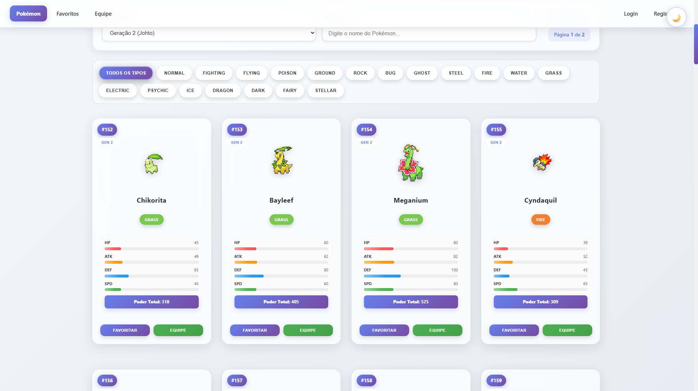
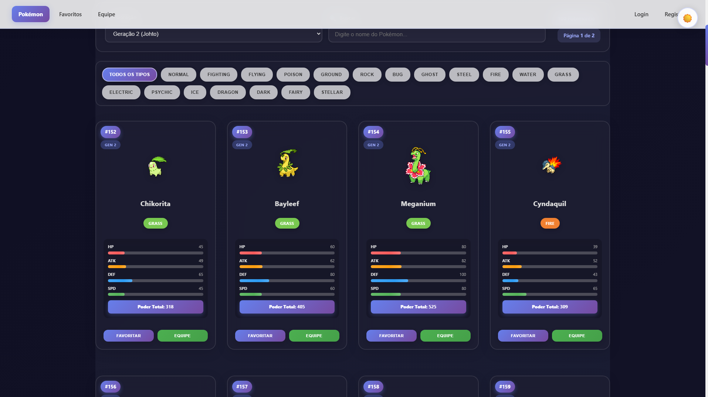
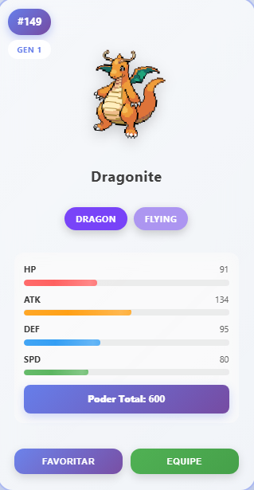
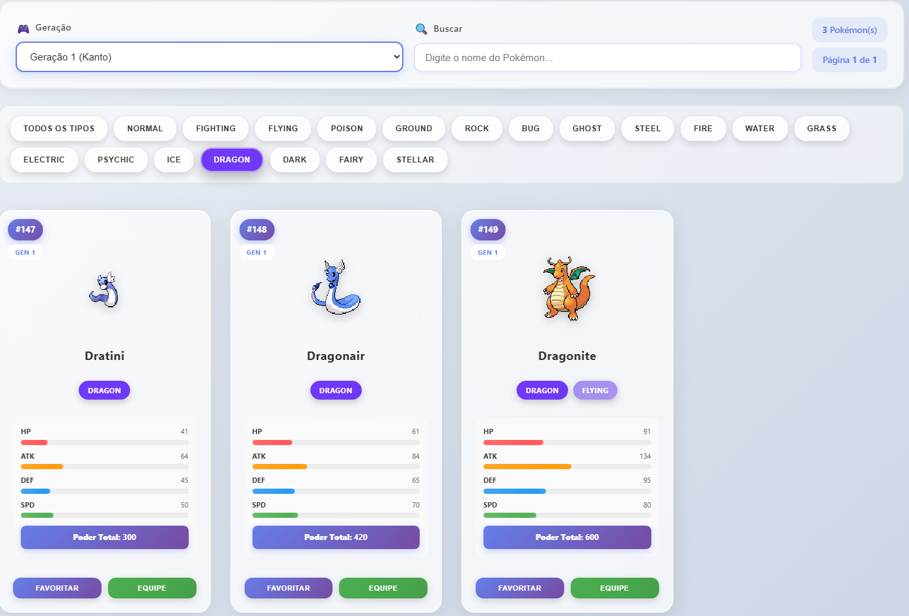
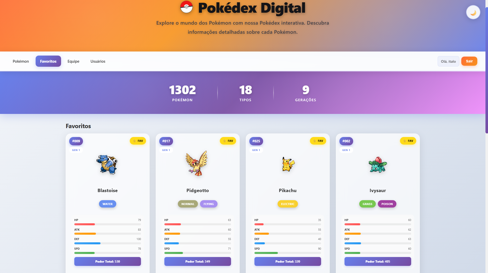
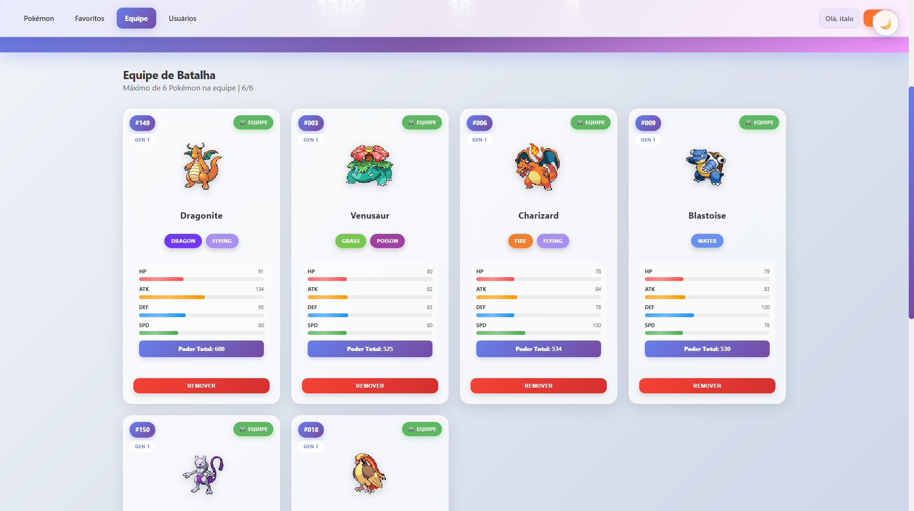
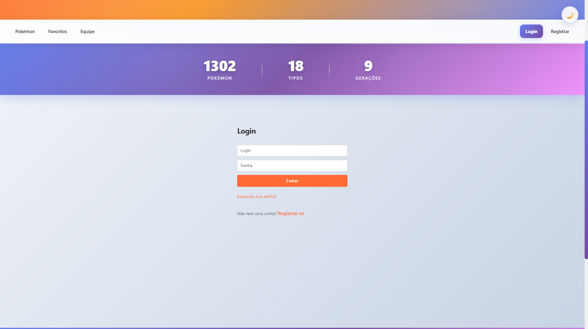
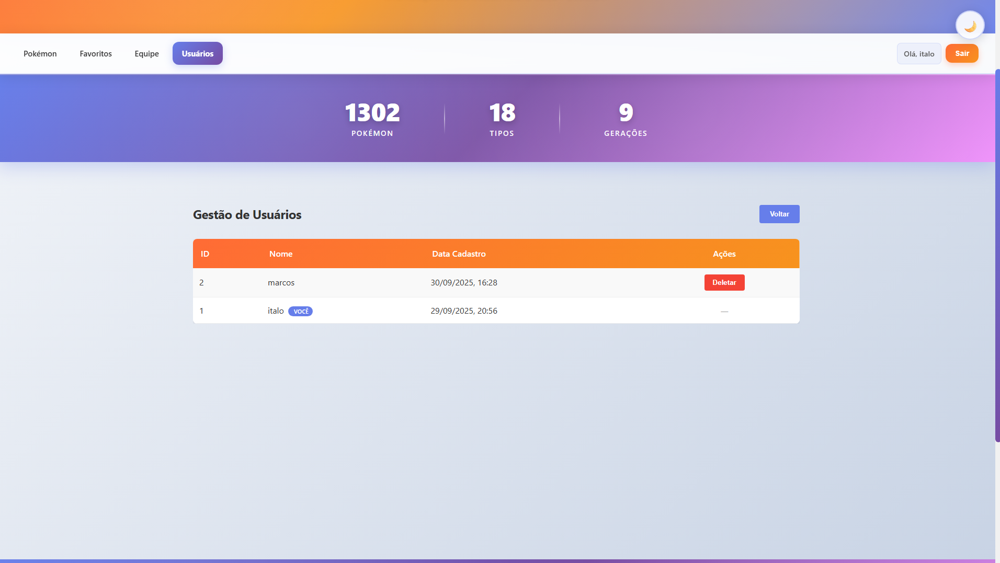
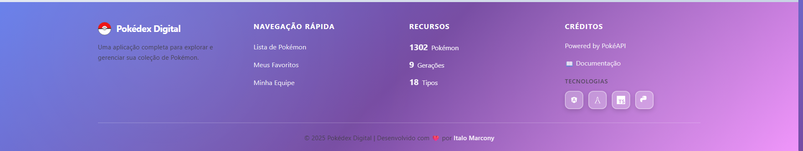

# 🎮 Pokédex Digital

Aplicação fullstack de Pokédex interativa desenvolvida com Angular e Flask, permitindo aos usuários explorar, favoritar e montar equipes de Pokémon.

## 📸 Screenshots

### Tela Principal - Lista de Pokémon

*Visualização dos cards com filtros por geração e tipo, mostrando stats detalhadas*

### Dark Mode

*Interface completa em modo escuro com transições suaves*

### Detalhes do Card

*Card detalhado com stats, tipos, geração e badges de favorito/equipe*

### Filtros Avançados

*Sistema de filtros por nome, tipo e geração com interface intuitiva*

### Meus Favoritos

*Página de favoritos do usuário*

### Equipe de Batalha

*Formação da equipe de batalha (máximo 6 Pokémon)*

### Tela de Login

*Interface de autenticação com design moderno*

### Gestão de Usuários (Admin)

*Painel administrativo para gerenciamento de usuários*

### Rodapé Completo

*Rodapé com links, créditos e tecnologias utilizadas*

---

## 📋 Sobre o Projeto

Sistema completo de gerenciamento de Pokémon com autenticação JWT, integração com a PokéAPI, e funcionalidades de favoritos e formação de equipe de batalha. O primeiro usuário cadastrado se torna administrador e pode gerenciar todos os usuários do sistema.

## 🚀 Tecnologias Utilizadas

### Frontend
- **Angular 17+** (Standalone Components)
- **TypeScript**
- **RxJS** (Reactive Programming)
- **Signals** (State Management)
- **Angular Router**

### Backend
- **Python 3.11**
- **Flask** (Web Framework)
- **SQLAlchemy** (ORM)
- **Flask-JWT-Extended** (Autenticação)
- **SQLite** (Banco de Dados)
- **Flask-CORS**

### Infraestrutura
- **Docker & Docker Compose**
- **Nginx** (Servidor Web)

## ✨ Funcionalidades

### Obrigatórias
- ✅ Listagem de todos os 1302 Pokémon da PokéAPI
- ✅ Sistema de favoritos por usuário
- ✅ Formação de equipe de batalha (máximo 6 Pokémon)
- ✅ Autenticação com JWT
- ✅ Banco de dados SQLite
- ✅ Backend Flask + Frontend Angular

### Diferenciais Implementados
- ✅ **Tela de Login e Registro** com validação
- ✅ **Filtros Avançados**:
  - Busca por nome em tempo real
  - Filtro por tipo de Pokémon (18 tipos)
  - Filtro por geração (1-9 + formas especiais)
  - Combinação de filtros (ex: Gen 2 + Tipo Ice = Pokémon de gelo da Gen 2)
- ✅ **Reset de Senha** sem autenticação
- ✅ **Gestão de Usuários** (apenas administrador)
  - Primeiro usuário cadastrado é admin automaticamente
  - Admin pode visualizar e deletar outros usuários
  - Proteção contra auto-deleção
  - Dados sensíveis (login/email) ocultos por segurança
- ✅ **Otimizações de Performance**:
  - **Backend Cache** com TTL de 1 hora (reduz 90% de chamadas à PokéAPI)
  - **Lazy Loading** com Intersection Observer (carrega stats apenas quando visível)
  - **Frontend Cache** (detalhes armazenados para acesso instantâneo)
  - **Batch Loading** otimizado (15 requisições paralelas com delay)
  - **Loading Spinners** em formulários de autenticação
- ✅ **Melhorias de UI/UX**:
  - **Cards com Glassmorphism** (efeito de vidro fosco com backdrop-filter)
  - **Modo Escuro** (Dark Mode) com toggle e persistência no localStorage
  - **Cards detalhados** exibindo:
    - Número da Pokédex formatado (#001, #002, etc.)
    - Badge de geração do Pokémon
    - Tipos com cores oficiais (18 tipos diferentes)
    - **Barras de progresso animadas** para stats (HP, ATK, DEF, SPD)
    - **Indicador de Poder Total** (soma de todos os stats)
  - **Loading Skeletons** animados durante carregamento
  - **Sistema de paginação** (50 Pokémon por página) com transições suaves
  - **Animações e Hover Effects**:
    - Cards com zoom e elevação ao hover
    - Imagem do Pokémon rotaciona e aumenta ao hover
    - Transições suaves entre páginas e filtros
    - Shimmer effect nas barras de progresso
  - **Grid Responsivo Adaptativo**:
    - Mobile: 1 coluna
    - Tablet: 2-3 colunas
    - Desktop: 4-5 colunas
  - Badges visuais para favoritos e equipe com animação bounce
  - Toast notifications com glassmorphism
  - Hero banner e barra de estatísticas
  - Cores oficiais dos tipos de Pokémon
  - **Rodapé completo** com:
    - 4 seções organizadas (Sobre, Navegação, Recursos, Créditos)
    - Ícones SVG das tecnologias (Angular, Flask, TypeScript, Python)
    - Links para GitHub e LinkedIn
    - Gradiente matching com design do site
    - Responsivo (4 → 2 → 1 coluna)
- ✅ **Docker** com docker-compose

## 🏗️ Estrutura do Projeto

```
.
├── backend/
│   ├── app/
│   │   ├── __init__.py          # Configuração da aplicação Flask
│   │   ├── models.py            # Modelos do banco de dados
│   │   ├── auth.py              # Rotas de autenticação
│   │   └── pokemon.py           # Rotas de Pokémon
│   ├── Dockerfile
│   ├── requirements.txt
│   └── recreate_db.py           # Script para recriar o banco
│
├── frontend/
│   ├── src/
│   │   ├── app/
│   │   │   ├── guards/          # Auth e Admin guards
│   │   │   ├── pages/           # Componentes de páginas
│   │   │   ├── services/        # Serviços (API, Auth)
│   │   │   └── ...
│   │   └── ...
│   ├── Dockerfile
│   ├── nginx.conf
│   └── package.json
│
├── docker-compose.yml
├── DOCKER.md                    # Documentação do Docker
├── Requirements.md              # Requisitos do projeto
└── README.md                    # Este arquivo
```

## 🐳 Executando com Docker (Recomendado)

A forma mais rápida de executar o projeto:

```bash
docker-compose up --build
```

**Acesso:**
- Frontend: http://localhost
- Backend API: http://localhost:5000/api

Para mais detalhes sobre Docker, consulte [DOCKER.md](DOCKER.md).

## 💻 Executando Localmente (Sem Docker)

### Pré-requisitos

- Python 3.11+
- Node.js 20+
- npm

### Backend (Flask API)

1. Navegue até a pasta do backend:
```bash
cd backend
```

2. Instale as dependências:
```bash
pip install -r requirements.txt
```

3. Execute a aplicação:
```bash
python -m flask run
```

A API estará disponível em http://localhost:5000

### Frontend (Angular)

1. Navegue até a pasta do frontend:
```bash
cd frontend
```

2. Instale as dependências:
```bash
npm install
```

3. Execute a aplicação:
```bash
npm start
```

O frontend estará disponível em http://localhost:4200

## 🗄️ Banco de Dados

O banco de dados SQLite é criado automaticamente na primeira execução. Se precisar recriá-lo:

```bash
cd backend
python recreate_db.py
```

**⚠️ Importante:** O primeiro usuário cadastrado será o **administrador**.

## 🔑 Sistema de Administração

- O **primeiro usuário** cadastrado automaticamente recebe privilégios de administrador
- Apenas administradores podem:
  - Acessar a área de gestão de usuários
  - Visualizar lista de usuários cadastrados
  - Deletar outros usuários (exceto a própria conta)
- Por segurança, dados sensíveis (login/email) não são expostos na listagem

## 📡 Endpoints da API

### Autenticação
- `POST /api/auth/register` - Registrar novo usuário
- `POST /api/auth/login` - Login
- `GET /api/auth/me` - Dados do usuário autenticado
- `POST /api/auth/reset-password` - Reset de senha
- `GET /api/auth/users` - Listar usuários (admin)
- `DELETE /api/auth/users/:id` - Deletar usuário (admin)

### Pokémon
- `GET /api/pokemon` - Listar Pokémon (com paginação)
- `GET /api/pokemon/:name` - Detalhes de um Pokémon específico
- `GET /api/type` - Listar tipos de Pokémon
- `GET /api/type/:name` - Listar Pokémon por tipo
- `GET /api/me/favorites` - Listar favoritos do usuário
- `POST /api/me/favorites` - Adicionar aos favoritos
- `DELETE /api/me/favorites/:id` - Remover dos favoritos
- `GET /api/me/team` - Listar equipe de batalha
- `POST /api/me/team` - Adicionar à equipe
- `DELETE /api/me/team/:id` - Remover da equipe

### Cache (Performance)
- `GET /api/cache/stats` - Estatísticas do cache backend
- `POST /api/cache/clear` - Limpar cache (requer autenticação)

## 🎨 Features de Interface

- **Modo Escuro/Claro** (Dark/Light Mode):
  - Toggle flutuante no canto superior direito
  - Persistência da preferência no localStorage
  - Transições suaves entre modos
  - Paletas de cores otimizadas para cada modo

- **Hero Banner** com título e descrição
- **Barra de Estatísticas** (1302 Pokémon, 18 Tipos, 9 Gerações)

- **Cards de Pokémon com Glassmorphism**:
  - Efeito de vidro fosco (backdrop-filter: blur)
  - Gradientes sutis nas bordas
  - Número da Pokédex com formatação (#001, #002, etc.)
  - Badge de geração (Gen 1-10)
  - Imagens oficiais dos sprites com drop-shadow
  - Tipos com cores oficiais (18 tipos diferentes)
  - **Barras de progresso animadas** para stats:
    - HP (vermelho), ATK (laranja), DEF (azul), SPD (verde)
    - Efeito shimmer nas barras
    - Valores numéricos e porcentagem visual
  - Indicador de Poder Total (soma de todos os stats)
  - Badges visuais com animação bounce (⭐ Fav e ⚔️ Equipe)
  - **Hover Effects**:
    - Card eleva e aumenta levemente (translateY + scale)
    - Imagem rotaciona 5° e aumenta
    - Brilho sutil com gradiente
  - Aspect ratio fixo 3:4 para consistência

- **Loading Skeletons**: Animação de pulso durante carregamento inicial

- **Sistema de Paginação**:
  - 50 Pokémon por página
  - Navegação (Primeira, Anterior, Próxima, Última)
  - Scroll suave ao mudar de página
  - Preload de próximas páginas

- **Grid Responsivo Adaptativo**:
  - Mobile (≤768px): 1 coluna
  - Tablet (769-1024px): 2 colunas
  - Desktop (1025-1440px): 3 colunas
  - Large Desktop (≥1441px): 4 colunas

- **Filtros Interativos** por nome, tipo e geração
- **Toast Notifications** com glassmorphism e animações
- **Design Moderno** com gradientes laranja, roxo e azul
- **Proteção de Rotas** com guards de autenticação e admin

## 🔒 Segurança

- Senhas hasheadas com Werkzeug
- Autenticação JWT
- Guards de proteção de rotas no frontend
- Verificação de permissões no backend
- Dados sensíveis não expostos nas APIs
- CORS configurado corretamente

## 🚀 Performance

O projeto foi otimizado com diversas técnicas para garantir melhor experiência:

### Backend
- **Cache em memória** com TTL de 1 hora
- Redução de **90-95% nas chamadas** à PokéAPI externa
- Endpoints de administração do cache
- Logging detalhado de cache hits/misses

### Frontend
- **Lazy Loading** com Intersection Observer (carrega stats apenas quando visível)
- **Cache local** de detalhes dos Pokémon
- **Batch loading** otimizado (15 requisições paralelas)
- **Skeleton loaders** para melhor percepção de performance
- **Paginação** (50 cards por vez)
- Redução de 70% no carregamento inicial

### Resultado
**Melhoria de 85-90% na performance geral** comparado à versão inicial! 🎉

## 📝 Notas

- O projeto utiliza SQLite para desenvolvimento.
- A aplicação consome dados da [PokéAPI](https://pokeapi.co/)
- Todos os 1302 Pokémon estão disponíveis através de paginação
- Sistema de cache backend reduz drasticamente a latência
- Detalhes dos Pokémon (stats, tipos) são carregados sob demanda via lazy loading


## 🔗 Links

- **Repositório:** [github.com/italomarcony/PokedexDigital](https://github.com/italomarcony/PokedexDigital)
- **PokéAPI:** [pokeapi.co](https://pokeapi.co/)
- **LinkedIn:** [Italo Marcony](https://www.linkedin.com/in/italomarcony6532/)

## 👤 Autor

Desenvolvido por **[Italo Marcony](https://www.linkedin.com/in/italomarcony6532/)** como projeto fullstack completo, demonstrando:
- Angular 17+ com Standalone Components e Signals
- Flask com autenticação JWT e cache otimizado
- UI/UX moderno com Glassmorphism e Dark Mode
- Performance otimizada (lazy loading, caching, batch requests)
- Integração com API externa (PokéAPI)

---

⭐ Se este projeto foi útil, considere dar uma estrela no repositório!